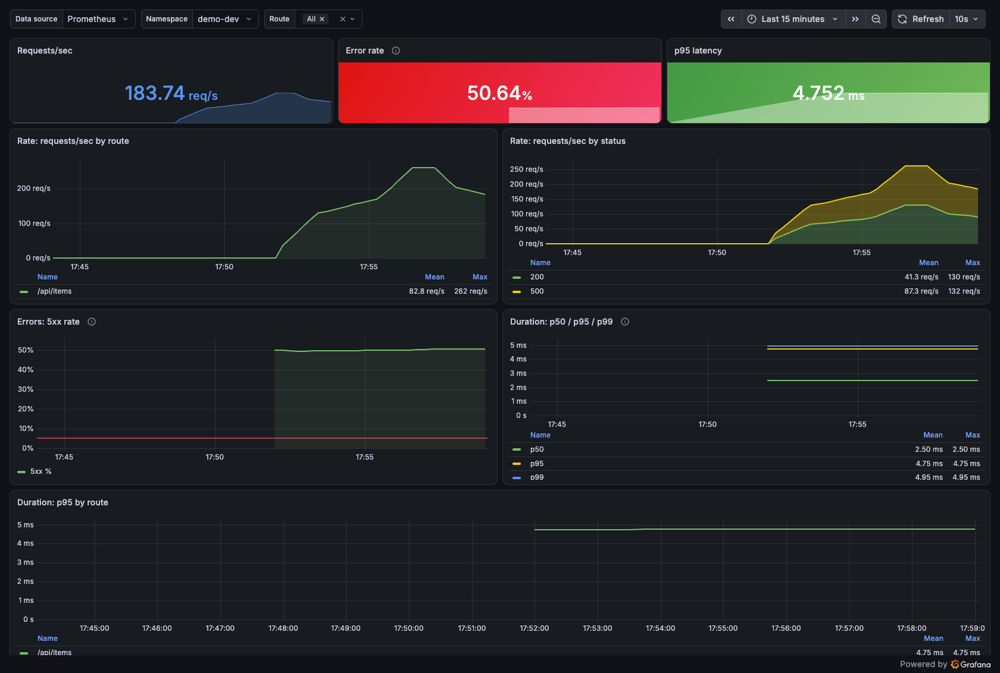
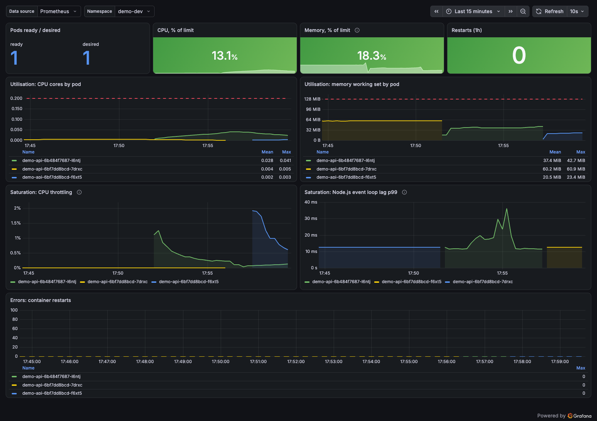
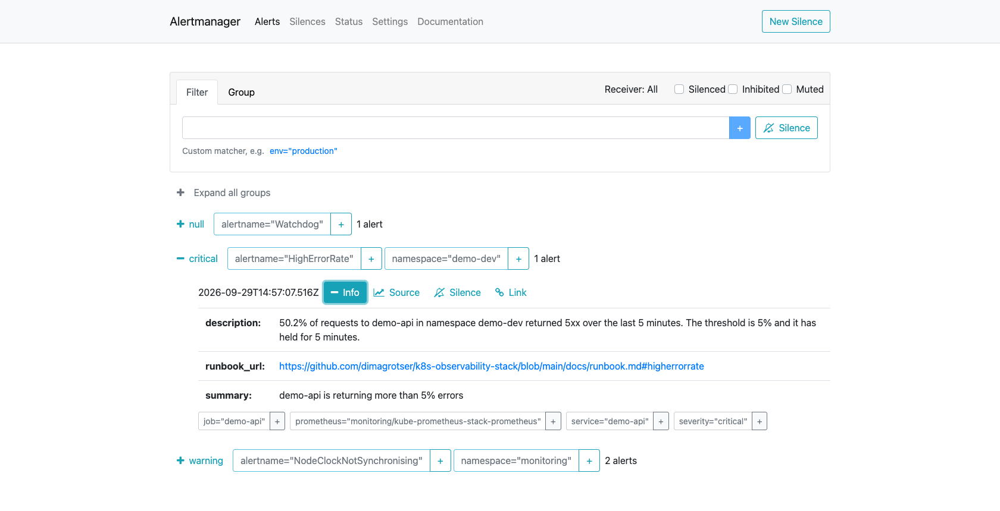
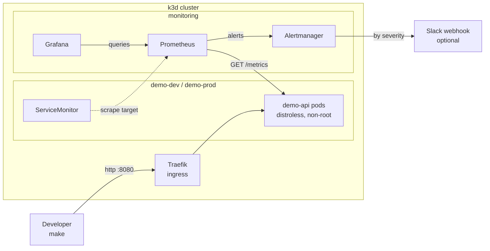

# k8s-observability-stack

[](https://github.com/dimagrotser/k8s-observability-stack/actions/workflows/ci.yml)


A small HTTP API deployed to a local Kubernetes cluster with the observability
work done the way it would be done in production: RED metrics on the service and
USE metrics on the workload, dashboards and alert rules stored as code rather
than clicked together in a UI, a runbook section for every alert, and a CI
pipeline that validates the manifests and then proves the whole thing deploys by
building a real cluster and smoke testing it. Two environment variables make the
service fail or slow down on demand, so the alerts can be demonstrated rather
than described. Everything runs locally on k3d, with no cloud account and
nothing to pay for.

## Quickstart

```bash
make up      # cluster, monitoring stack, image, deploy
make smoke   # check every endpoint through the ingress
make urls    # print the local URLs and how to get the Grafana password
```

`make up` takes a few minutes the first time, mostly pulling the monitoring
images. After that:

| What | URL | Credentials |
|---|---|---|
| demo API | http://demo.localhost:8080 | none |
| Grafana | http://grafana.localhost:8080 | `admin` / `make grafana-password` |
| Prometheus | http://prometheus.localhost:8080 | none |
| Alertmanager | http://alertmanager.localhost:8080 | none |

To watch an alert fire end to end:

```bash
make demo-alert
```

## Dashboards

`demo-api / RED` during `make demo-alert`, with `ERROR_RATE=0.5`. The 5xx panel
sits on its plateau well above the red 5% threshold line, and the split by
status shows where the traffic went.



`demo-api / USE` over the same window. CPU and memory are drawn against their
limits as dashed lines, CPU throttling appears as the load lands, and the
Node.js event loop lag spikes to 37ms. That last panel is the reason it exists:
event loop saturation does not show up in the container CPU numbers.



Alertmanager once the alert has held for its five minutes. The groups are the
severity routing: `Watchdog` to the null receiver, `HighErrorRate` to critical,
the node clock warning to warning. The expanded alert shows the rendered
description and the runbook link.



## Architecture



[docs/architecture.md](docs/architecture.md) has the full picture: the signal
flow, the CI pipeline and the request path through the metrics middleware.

## What this demonstrates

- **Metrics that survive contact with reality.** The `route` label is the
  matched route template, never the raw URL, so a vulnerability scanner cannot
  blow up Prometheus cardinality. A unit test asserts this.
- **Alerts with hold durations that mean something.** 5% errors for 5 minutes,
  not one bad request. Every alert links to a runbook section that actually
  exists, and CI fails if the anchor does not.
- **Dashboards and alert rules as code.** JSON dashboards provisioned through
  ConfigMaps, `PrometheusRule` objects applied with Kustomize. Nothing is
  configured by hand in a UI.
- **Alert rules under unit test.** `promtool test rules` covers all five alerts
  with a firing case and a quiet case each, asserting the rendered annotations
  character for character.
- **A container that is hard to misuse.** Distroless base, no shell, non-root
  uid 65532, read-only root filesystem, all capabilities dropped, seccomp
  `RuntimeDefault`, resource requests and limits set.
- **A deploy that does not drop capacity.** The prod overlay uses
  `maxUnavailable: 0`, a PodDisruptionBudget and an HPA whose `minReplicas`
  matches the declared replica count so the two do not fight.
- **CI that proves the deploy works.** Manifest validation is cheap and catches
  typos. The e2e job builds a real k3d cluster and applies the same manifests
  the repository ships.
- **Decisions written down.** [docs/decisions.md](docs/decisions.md) explains
  the eight choices a reviewer is most likely to question, including what each
  one costs.

## The app

A Node.js HTTP API in [`app/`](app). Four endpoints, no database, no
dependencies beyond Express and the Prometheus client.

| Endpoint | Purpose |
|---|---|
| `GET /health` | liveness, no dependencies, so a failure always means "restart me" |
| `GET /ready` | readiness, red during warm-up and while draining |
| `GET /api/items` | the business endpoint, subject to the chaos knobs |
| `GET /metrics` | Prometheus exposition |

RED metrics are `http_requests_total`, `http_request_errors_total` and
`http_request_duration_seconds`, all labelled by `route`, `method` and `status`.
The histogram has an explicit bucket boundary at 0.5s so the p95 alert threshold
is measured rather than interpolated across a wide bucket.

On `SIGTERM` the app fails readiness first and only closes the listener after a
grace period, because endpoint removal reaches the ingress asynchronously.

### Chaos knobs

| Variable | Range | Effect |
|---|---|---|
| `ERROR_RATE` | 0.0 to 1.0 | share of `/api/items` requests that return 500 |
| `EXTRA_LATENCY_MS` | 0 to 60000 | delay added to `/api/items` |

They apply to `/api/items` only. If they also hit the probes, a high error rate
would restart the pod and the demo would show a crash loop instead of the error
rate alert.

```bash
kubectl -n demo-dev set env deploy/demo-api ERROR_RATE=0.5
make deploy    # reapplies the declared state
```

## Observability

Prometheus scrapes the app through a `ServiceMonitor` in `k8s/base`, so the app
is never named in a Prometheus config file. Two dashboards live in
`monitoring/dashboards/` as JSON and reach Grafana as ConfigMaps that the Grafana
sidecar picks up by label. Editing the JSON and running `make dashboards` is the
only way dashboards change here.

| Dashboard | Shows |
|---|---|
| `demo-api / RED` | requests/sec, 5xx rate, p50/p95/p99 latency, all per route |
| `demo-api / USE` | CPU and memory against their limits, CPU throttling, event loop lag, restarts |

Every RED query excludes `/health`, `/ready` and `/metrics`. Those are probe and
scrape traffic, not user traffic, and a 503 from `/ready` during warm-up would
otherwise be counted as a service error. The metrics themselves still record it,
which is [decision 5](docs/decisions.md).

The Grafana admin password is generated by `make grafana-secret` into
`monitoring/secrets/`, which is gitignored. Nothing in this repository contains a
credential.

## Alerting

Five alerts in `monitoring/rules/`, each with `summary`, `description`, a
`severity` label and a `runbook_url` pointing at the matching section of
[docs/runbook.md](docs/runbook.md).

| Alert | Severity | Fires when |
|---|---|---|
| `HighErrorRate` | critical | over 5% 5xx for 5m |
| `HighLatencyP95` | warning | p95 over 500ms for 5m |
| `PodCrashLooping` | critical | container in CrashLoopBackOff for 2m |
| `PodNotReady` | warning | readiness probe failing for 5m |
| `HighMemoryUsage` | warning | over 90% of the memory limit for 5m |

Alertmanager routes by severity: critical gets a 10 second group wait and
repeats hourly, warning repeats every 12 hours, and the always-firing `Watchdog`
heartbeat goes to a null receiver so it never reaches a human. While a critical
alert is firing, the matching warning for the same alert and namespace is
inhibited.

```bash
make rules-check   # promtool syntax, annotations, runbook anchors
make rules-test    # promtool unit tests
```

### Plugging in Slack

The receivers ship with no webhook, because a Slack URL is a credential. Out of
the box nothing is sent anywhere and alerts are visible in the Alertmanager UI.
To deliver for real:

```bash
cp monitoring/alertmanager-webhook.example.yaml monitoring/secrets/alertmanager-webhook.yaml
# put your https://hooks.slack.com/services/... URL in the copy
make monitoring-up HELM_EXTRA_VALUES=monitoring/secrets/alertmanager-webhook.yaml
```

The example file also shows the `slack_configs` variant if you want channel
names and per-severity colours instead of a plain webhook POST.

## Environments

`k8s/base` holds what is the same everywhere. Two overlays differ from it.

| | dev | prod |
|---|---|---|
| Namespace | `demo-dev` | `demo-prod` |
| Ingress host | `demo.localhost` | `demo-prod.localhost` |
| Replicas | 1 | 3 |
| Rollout | default | `maxUnavailable: 0`, `maxSurge: 1` |
| Requests | 50m / 64Mi | 100m / 96Mi |
| Limits | 200m / 128Mi | 500m / 192Mi |
| Autoscaling | none | HPA, 3 to 10 pods at 70% CPU |
| Disruption budget | none | `minAvailable: 2` |
| Pod spread | none | one per node where possible |

Both overlays can be deployed to the same local cluster at once, because they
use different namespaces and different ingress hosts.

```bash
make deploy-prod
make smoke-prod
```

The HPA scales up immediately and scales down over a five minute stabilisation
window. Being briefly over-provisioned costs money; being under-provisioned
costs requests.

## CI

`.github/workflows/ci.yml` runs five jobs in parallel on every push and pull
request. Every tool version is pinned in the workflow's `env` block.

| Job | What it does |
|---|---|
| `app` | eslint and the unit tests, with the npm cache keyed on the lockfile |
| `manifests` | `kustomize build` over every overlay, then kubeconform in strict mode, including the Prometheus operator CRDs |
| `rules` | `promtool check rules`, the annotation and runbook-anchor check, and `promtool test rules` |
| `image` | buildx build with a GitHub Actions layer cache, pushed to GHCR on pushes but not on pull requests |
| `e2e` | creates a real k3d cluster, deploys the dev overlay, and smoke tests it |

The `manifests` job loops over `k8s/overlays/*/`, so a new overlay is validated
the moment it exists without touching the workflow.

The `e2e` job installs only the `ServiceMonitor` CRD rather than the whole
monitoring stack. The manifests applied are exactly the ones this repository
ships, and installing one CRD takes seconds where the full chart takes minutes.

Images are tagged with the commit SHA, the branch or PR, and the semver tag
where there is one. There is deliberately no `latest`.

## Repository layout

```
app/                    Node.js service, tests, multi-stage Dockerfile
k3d/cluster.yaml        cluster definition, pinned k3s version
k8s/base/               deployment, service, ingress, servicemonitor
k8s/overlays/dev/       1 replica, chaos off
k8s/overlays/prod/      3 replicas, HPA, PDB, zero-downtime rollout
monitoring/values.yaml  kube-prometheus-stack values
monitoring/rules/       PrometheusRule objects and their promtool unit tests
monitoring/dashboards/  Grafana dashboards as JSON
scripts/                load generator, alert demo, rule checks
docs/                   architecture, runbook, decisions
.github/workflows/      CI
```

## Make targets

Run `make` with no arguments for the full list.

## Requirements

Docker, k3d, kubectl, helm and kustomize for running it. Node.js to work on the
app. promtool, kubeconform and yq to run the checks locally; CI installs its own
pinned copies.

```bash
brew install k3d kubernetes-cli helm kustomize node prometheus kubeconform yq
```

## Possible extensions

Deliberately out of scope, listed so the boundary is explicit rather than
accidental:

- Argo CD or Flux for GitOps, so the cluster pulls rather than CI pushing.
- Loki for logs and Tempo with OpenTelemetry for traces, to complete the three
  signals.
- Thanos or Mimir for long term metric storage beyond the current 24 hours.
- A service mesh for mTLS and traffic shifting.
- Kyverno or OPA Gatekeeper to enforce the pod security settings rather than
  relying on them being written correctly.
- Sealed Secrets or External Secrets instead of a gitignored local file.
- shellcheck in CI for the helper scripts.
