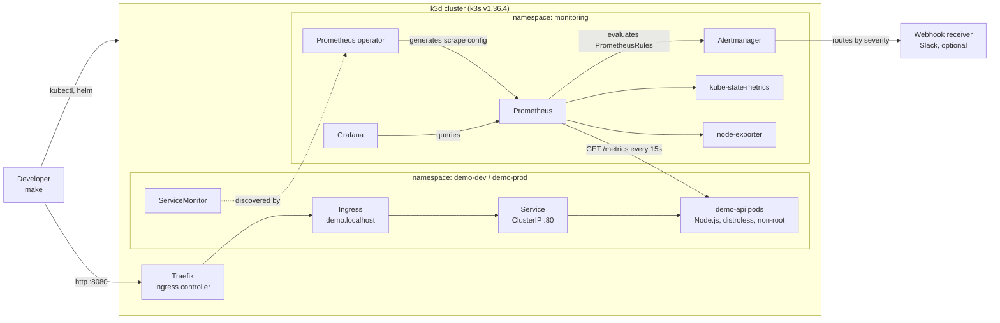
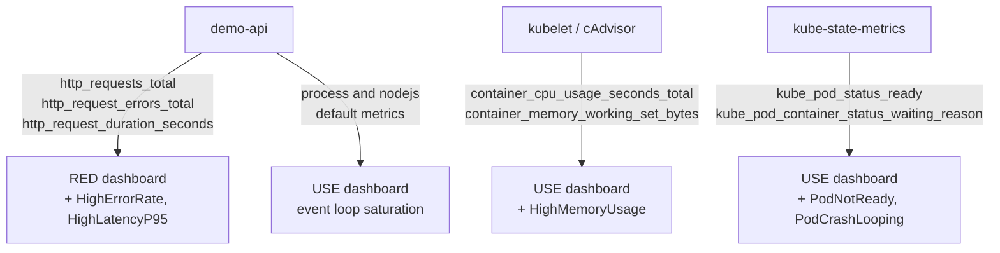
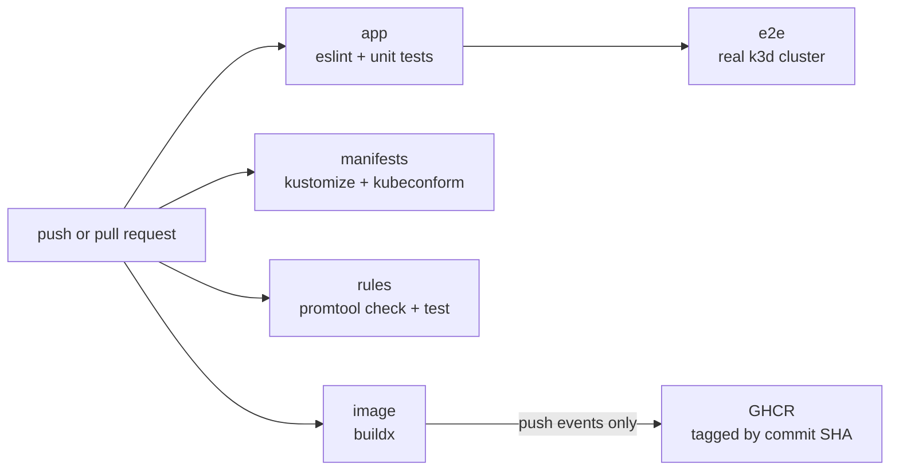
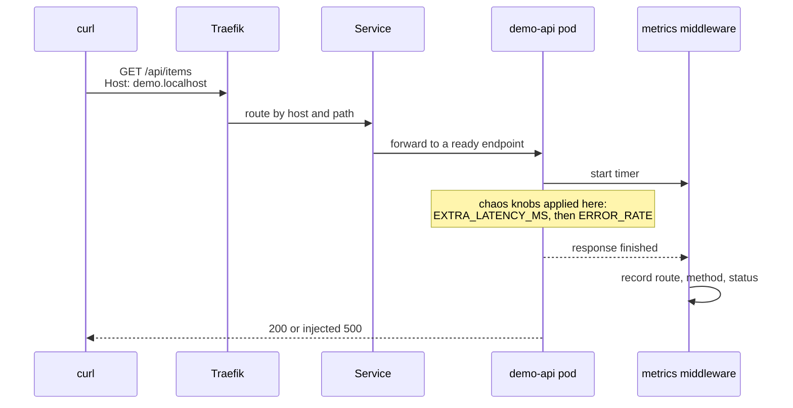

# Architecture

Everything runs on one local k3d cluster. There is no cloud account, no managed
service and no paid tier anywhere in this diagram.

## Runtime

The app is never named in a Prometheus configuration file. The `ServiceMonitor`
in `k8s/base` is what the operator turns into a scrape target, which is the
whole point of running the operator instead of hand-editing config.

## Signals

Application metrics answer "is the service healthy for its users". Container and
cluster metrics answer "is the workload healthy". Both dashboards exist because
those are different questions and they fail in different ways.

## Delivery

The five jobs run in parallel. `e2e` waits for `app`, because there is no point
burning a cluster on code that does not lint.

## Request path in detail

The metrics middleware labels the request with the matched route template, not
the raw URL. `/api/items?id=1` and a 404 from a scanner would otherwise each
create their own time series.
